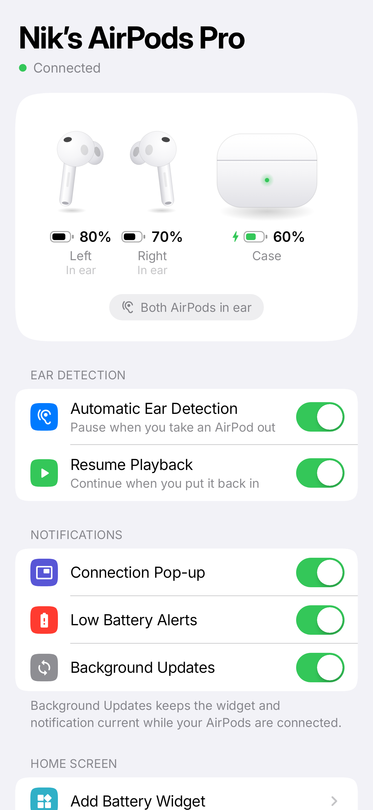
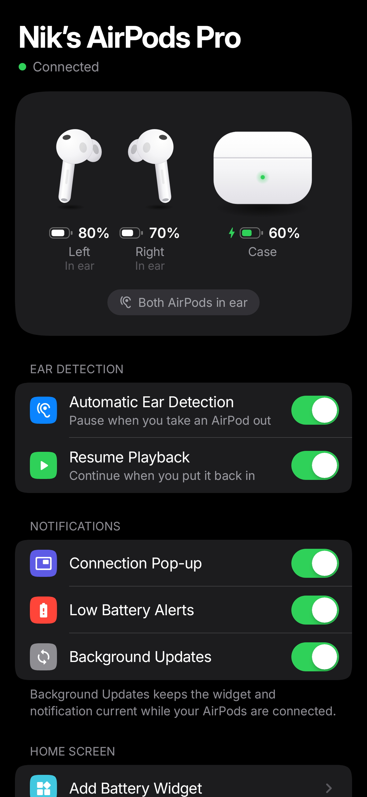
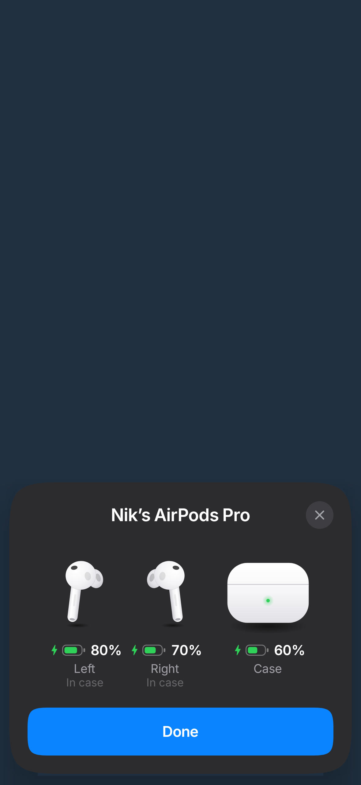
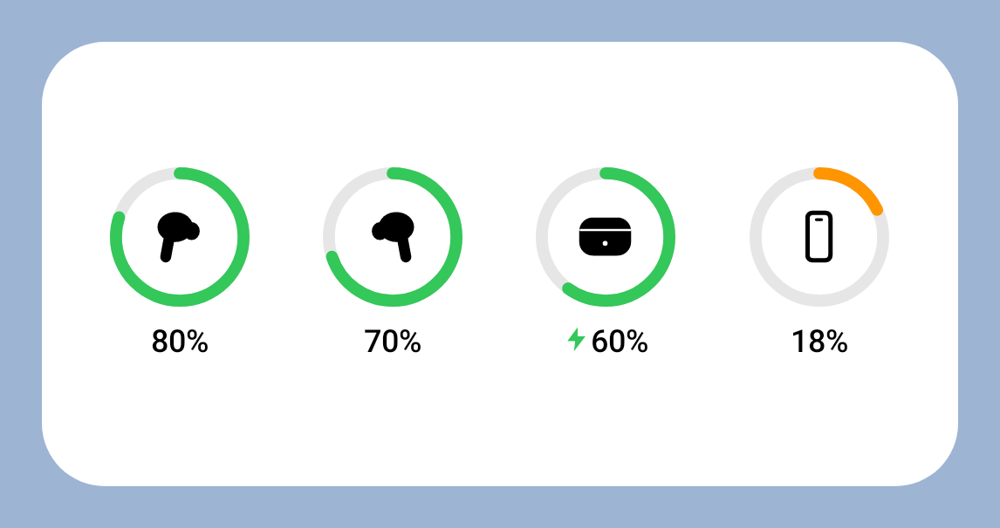
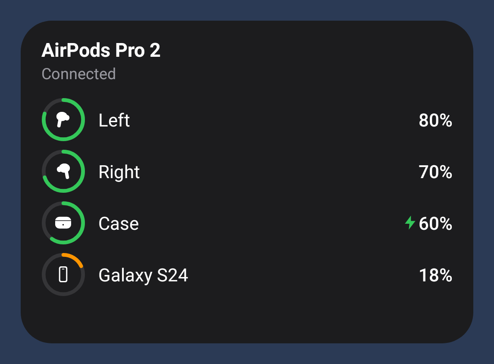

# Pods: AirPods for Android

A native Android companion app for AirPods with a clean, iOS-style interface.

<p>
  
  
  
</p>
<p>
  
  
</p>

## Install

1. On your phone, open
   **https://github.com/Donix1337/Calella-2026/releases/tag/pods-latest**
   and download `Pods.apk`.
2. Open the file. If Android asks, allow your browser to "install unknown apps".
3. Open **Pods**, tap **Continue** and allow **Nearby devices** and notifications.
4. When asked, allow Pods to run in the background (Samsung: **Battery → Unrestricted**).
   Without this, Android won't let Pods start by itself when your AirPods connect.

Every push to the `airpods-app/` folder rebuilds the APK and replaces that release.
Each new build installs over the previous one and keeps your settings.

Requires Android 12 or newer.

## What it does

- **Live battery** for the left and right AirPod and the case, with charging state,
  in an iPhone-style card. The last known case level is kept while the case is closed.
- **Automatic ear detection.** Music pauses when you take an AirPod out and resumes
  when you put it back in.
- **Home Screen widget** in the style of the iOS Batteries widget: rings for left,
  right, case and your phone. It resizes from 2×2 (grid) to 4×2 (row) to 4×3 (list)
  and follows light/dark mode. Add it from the app or from the launcher's widget list.
- **Connection pop-up.** A card slides up with the battery levels when your AirPods
  connect. Needs "Display over other apps".
- **Battery notification** while connected, plus **low battery alerts** at 20%.
- Supports AirPods 1–4, AirPods Pro / Pro 2, AirPods Max and most Beats.

## How it works

AirPods broadcast a small Bluetooth LE message (Apple "proximity pairing") several times
a second while they're out of the case or the lid is open. It carries the battery of each
bud and the case in 10% steps, charging flags, and in-ear/in-case state. Pods decodes it
in `ble/ProximityParser.kt` and follows the strongest nearby signal so other people's
AirPods don't get mixed in (`ble/CandidateTracker.kt`).

While your AirPods are connected, a small foreground service (`service/PodsService.kt`)
keeps scanning so ear detection, the notification and the widget stay current. It starts
when Android reports the AirPods connected and stops shortly after they disconnect.

### Troubleshooting

If your AirPods show as connected but no battery appears:

1. Take an AirPod out, or open the case lid, next to the phone. AirPods only broadcast
   battery while they're out of a closed case.
2. Turn on **Location**. Some phones only pass Bluetooth scans to apps while it's on.
3. Open **Diagnostics** at the bottom of the app. "AirPods signals" counts the battery
   broadcasts the phone has received. If it stays at 0, the app automatically tries
   broader scan modes (hardware filter → Apple filter → software filter) and remembers
   the one that works.

Until the broadcast comes through, Pods shows the single battery level Android itself
gets from the AirPods, when the phone reports one.

### Limitations

- Battery is reported in 10% steps; that's all AirPods share with non-Apple devices.
- Noise control (ANC / Transparency) and other settings that live on the AirPods
  themselves need Apple's private accessory protocol. Android doesn't allow that
  connection without root, so Pods doesn't offer them.

## Building

Screenshots of every screen and widget size are rendered on CI by the Robolectric
screenshot tests (`./gradlew testDebugUnitTest --tests '*ScreenshotTest*' -PrecordScreens`)
and published to the `pods-screenshots` release.

```
cd airpods-app
./gradlew assembleRelease
```

The APK is written to `app/build/outputs/apk/release/app-release.apk`.

The signing key (`app/pods.keystore`) is committed so CI and local builds can update
each other. That's fine for a personal app; move it into CI secrets before sharing
the app more widely.

UI typography uses [Inter](https://rsms.me/inter/) (SIL Open Font License, see
`licenses/Inter-OFL.txt`).
